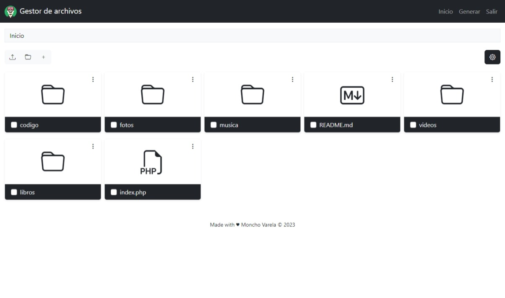
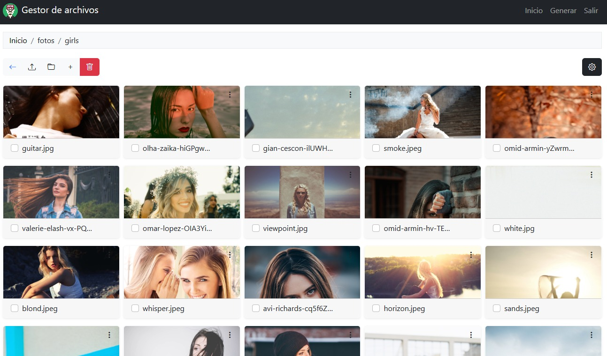
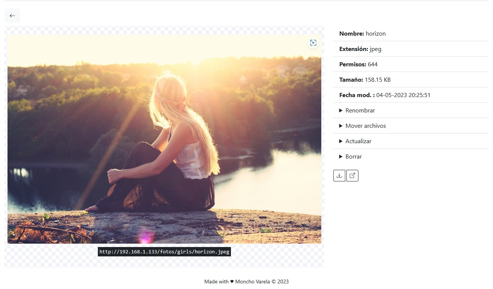
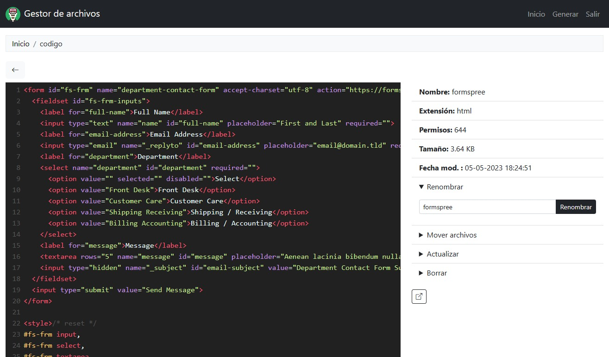
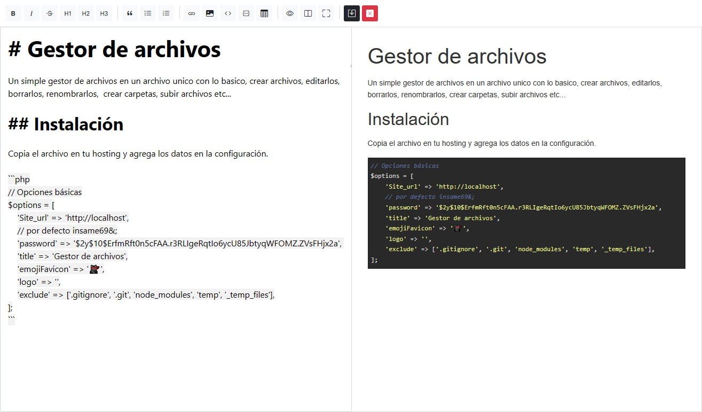

# Gestor de archivos

Práctico gestor de archivos en un solo archivo, que ofrece las funciones esenciales para gestionar tus archivos de manera eficiente: crear, editar, borrar y renombrar archivos, así como organizarlos en carpetas. Además, permite subir y descargar archivos de forma sencilla, brindándote una interfaz intuitiva y fácil de usar. 

## Instalación

Copia el archivo en tu hosting o en la Raspberry y agrega los datos en la configuración.

```php
// Opciones básicas
$options = [
    'Site_url' => 'http://localhost:8000',
    'password' => '$2y$10$ErfmRft0n5cFAA.r3RLIgeRqtIo6ycU85JbtyqWFOMZ.ZVsFHjx2a', // insame69&;
    'title' => 'Gestor de archivos',
    'emojiFavicon' => '🐱‍👤',
    'logo' => '',
    'exclude' => ['.gitignore', '.git', 'node_modules', '.htaccess', 'temp', '_temp_files'],
    'imageSupport' => ["ico", "jpg", "JPG", "JPEG", "jpeg", "png", "gif", "svg", "bmp", "webp"],
    'videoSupport' => ["mp4", "webm", "ogg", "mpeg", "mpg", "3gp"],
    'audioSupport' => ["wav", "mp3", "ogg", "m4a"],
    'editableFilesSupport' => ['less', 'scss', 'jsx', 'ts', 'tsx', 'json', 'sql','txt', 'md', 'html', 'htm', 'xml', 'css', 'js', 'php'],
    'nonEditableFilesSupport' => ["ttf", "otf", "woff", "woff2", "docx", "xlsx", "pptx", "accdb", "pub", "vsd", "doc", "xls", "ppt", "mdb", 'mo', 'po', 'db', 'pdf', 'zip'],
];
```

### Capturas de pantalla





